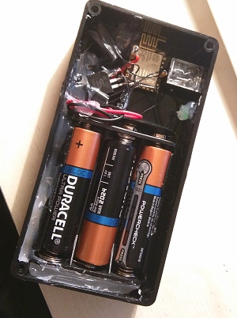
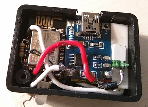

I recently received a batch of ESP8266 based modules I got on eBay for just over 2 GBP each, including shpping! So I sat down and built a small proto to figure out whare realistically can be achieved in a real life device, expecially in terms of battery consumption.

The below contraption was born. Pardon the huge amout of hot glue but, to be honest, I was more excited to get the module down to work than to create the final good looking piece of hardware.

This proto is powered by 3 AA batteries. My goal here is to evaluate both the stability and actual battery life of such a setup. This will come handy for not so small devices that will report relatively frequently and require months to years of battery life. Since I don't want to wait years I have set it up to wake up every minute and report battery voltage and room temperature to Thingspeak, in this way I should be able to run down the battery in a reasonable time and, from there extrapolate life expectancy for longer reportig intervals.

I have a second proto in the making that runs out of a 160mAh LiPo battery so it's really small in size. I don't really expect wonderful operating times but given the battery is recharghable and the size benefit it could be a good fit for types of applications with very seldom network activity.

You can have a look that the live feed of data here: http://nicolacimmino.com/WiFiTemperature.html

## Firmware

I have chosen to flash the NodeMCU firmware, it seems a nicely supported project that is getting better by the day. NodeMCU firmware allows to run LUA scripts on the ESP8266. One feature is that it autoruns a file named "init.lua" at boot if found, and that's the file where you will find all the code for this proto.

Besides the bare bones code to read battery voltage and temperature from an external DS18B20 and send it to Thinspeak I had to get few more things in place that might be of general interest to anyone developing for ESP8266.

First of all for anything that is supposed to run unattended you are going to need a good old watchdog. Something will go horribly wrong sooner or later and if it does you will be left with you module running, most likely connected to WiFi and draining your battery proably in few hours. So I added just this line:

    tmr.alarm(2,60000,0, function() node.restart() end)

If the alarm is not reset before 1 minute the all device will be rebooted. If your processing is going to take less than one minute all you need is to stop the timer before entering sleep, if it will take more than one minute reset the timer in a part of the code that executes more often than a minute.

Another thing I learned the hard way is that if you put code in init.lua that doesn't terminate (this doesn't, it just does its things and goes back to sleep) you will never have a chance to get to the LUA command prompt which means, after you load init.lua once you are forever locked out and cannot update it! The only way out is to put back the ESP into programming mode an flash the NodeMCU firmware again! Not good. So I came up with this little trick, just registered a listener for serial data incoming traffic and set it to delete init.lua if anything is received. For a more robust solution we could delete the init.lua script only if a specific string is received, but for now this will do:

    uart.on("data", 1,  
        function(data) 
        file.remove("init.lua")
        tmr.stop(1)
        tmr.stop(2)      
        uart.on("data")  
    end , 0)
    
So when you want to update init.lua just send a byte or two down the serial while the device is awake and you will be back to LUA prompt in no time.
